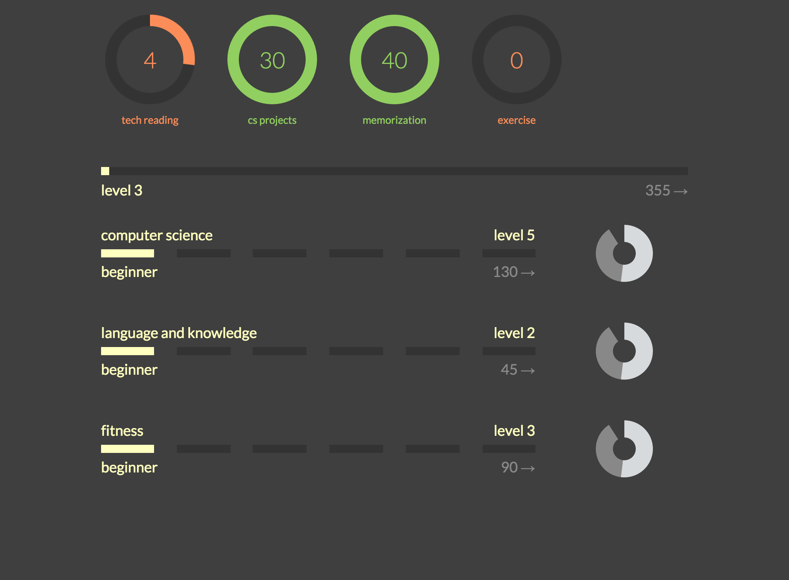

# levelup

Track minutes, gain experience for skills and levels, fight bosses, get
rewards. [Live alpha](http://rhubarb-crisp-2752.herokuapp.com/).

## Related work

After having done my brainstorming, background research on why games are
addicting, needs analysis, level math and balancing, mockups, and most of the
backend / frontend coding, I then discovered [HabitRPG](https://habitrpg.com/).

This will be a simple, less-featured version of HabitRPG, which only tracks
habits (and not TODOs and the rest). It also won't have pretend rewards.

Why not switch over to HabitRPG? Here is why I'm going to continue development
on `levelup` instead:

*	HabitRPG tries to get you to track too much, and all those extra features
	I don't need will distract me from what I really care about (establishing
	daily habits).

*	HabitRPG has ads, and a cluttered UI to support the above.

*	It's really easy to cheat HabitRPG. I made an account and clicked that I
	did something fifty times, and got tones of rewards. The whole reason RPGs
	are addicting is that you can't cheat. As sooon as I turn cheats on in any
	game, it loses all its appeal

## Acknowledgements

The old UI (see [docs/deprecated.md](docs/deprecated.md)) was heavily inspired
by Persona 3: FES for the PS2. The concept is as well (addicting JRPGs...). So,
hats off to the developers of P3FES!
