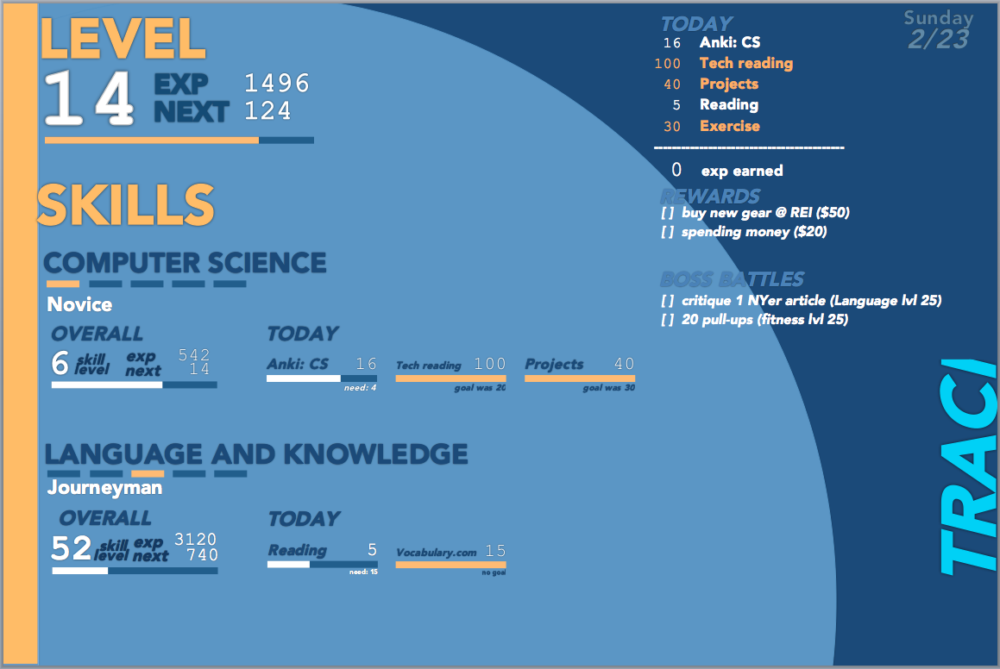

## Old development plan

Make a small, working app, without abilities or player levels or bosses or
rewards. **Skills only.** Try hosting locally as well as on Heroku, essentially
ensuring that databases locally and on heroku can be exported and used in one
another.

- [ ] Login & logout
	- [ ] Passport still, or better alternative?
	- [ ] Build
- [ ] Player and skill models
	- [ ] Update ORM charts
	- [ ] Pick ORM
	- [ ] Refresher or tutorial on ORM
- [ ] Skill views for list, add, and edit
	- [ ] Use something like backbone, or light enough?
	- [ ] Use scotch tutorial, or go solo?
	- [ ] Build, ensuring super good to use on mobile
- [ ] Favicon
- [ ] Test DB backup/restore/run on heroku
- [ ] Run locally

## Old old Development plan

### 1. Switch current models over to MongoDB + Mongoose

- [X] Make sure this is the right way to do a list of check boxes.
- [ ] Define models
- [ ] Match current functionality, which appears to be loading the basic page w/o bosses or rewards & a simple edit (+add) functionality.
- [ ] Cleanup the implementation to remove all CSV parsing crap, and all PG query crap. The data model that the old functions return might be so ingrained in the current code that it might just be worth starting fresh.
- [ ] Address TODOs to clean up the code.
- [ ] Hook up mongo to Heroku.
- [ ] Hook up mongo backups with Heroku. Extra credit: actually test this.
- [ ] Disable PG & PG backups.

### 2. Entire frontend should be async (Ajax)

- [ ] Controller should query # skills (abilities? can't remember nomenclature...) to select model (how many bootstrap columns)
- [ ] View should grab models from backend to populate
- [ ] Models in frontend should use backbone.js (or something else) so they can be updated effortlessly
- [ ] All models on page should update easily with a single mechanism, either cued by input or by a periodic refresh (e.g. every 10 seconds).

### 3. Implement add / edit / delete

- [ ] Abilities (if not already done)
- [ ] Bosses
- [ ] Rewards (code reuse with bosses?)

### 4. Implement rest of main page UI

- [ ] Bosses
- [ ] Rewards

### 5. Polish

- [ ] favicon.ico

## Deprecated: Setup

You need two files, which are both one-liner filess with URLs to an **old**
Google Docs Spreadsheet with certain data format.

- `exp_url` :   exp format (specified in web.js)
- `abilities_url` : abilities format (specified in web.js)

## Deprecated: UI

_A mockup of the UI I made (in Word!)_
